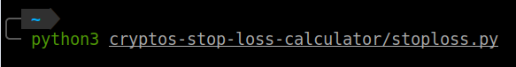
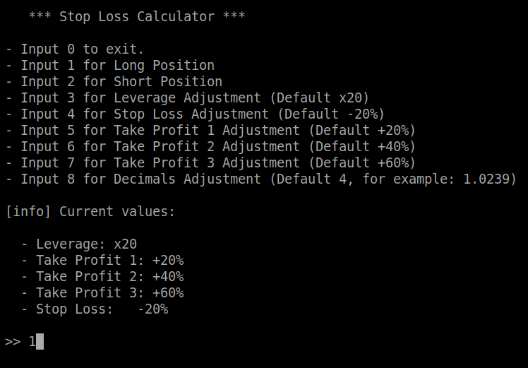

# Stop loss calculator

Crypto Futures Stop Loss and Take Profit Calculator written in Python

## Requirements

- Python 3
  
## Usage examples  

- Run with

- Main Menu, input "1" for the Long Position menu

- Long Example

